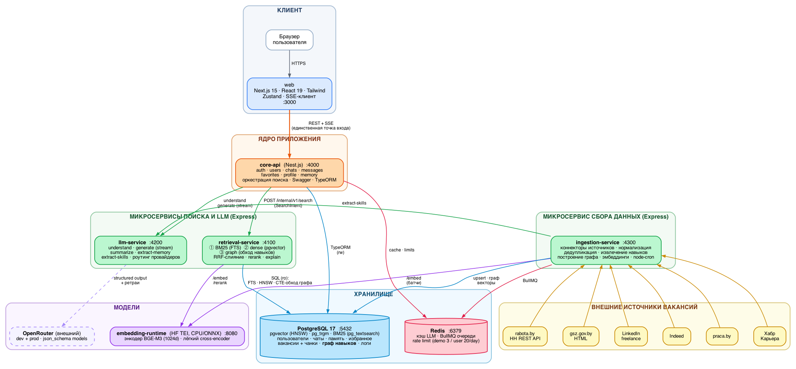

# Wiki — Курсовая работа 2027

Рабочая база знаний по проекту.

**Тема курсовой (рабочая формулировка):** «Разработка веб-приложения на основе RAG-архитектуры для автоматизированного подбора вакансий».

**Тема диплома:** [11-hira.md](11-hira.md) §5 (ADR-031).

**Продукт:** [Hira](11-hira.md) (Хайра) — имя приложения и AI-помощника.

---

## Карта документов

| Файл | Что внутри | Статус |
|---|---|---|
| [00-vision-and-scope.md](00-vision-and-scope.md) | Концепция, цели, границы проекта, отличия от курсовой 2026 | Черновик |
| [11-hira.md](11-hira.md) | **Продукт Hira:** имя, библиотека файлов, межчатовая память, голосовой вызов; тема диплома — §5 | Черновик |
| [01-architecture.md](01-architecture.md) | Микросервисная архитектура, состав сервисов, границы ответственности | Черновик |
| [02-retrieval-layer.md](02-retrieval-layer.md) | **Ключевой документ.** Слой языковой обработки: Sentence-BERT → Graph RAG → гибридный поиск. Обзор актуальных подходов и обоснование выбора | Черновик |
| [llm-lexical-graph-summary.md](llm-lexical-graph-summary.md) | **Краткая выжимка:** LLM-слой, BM25, Graph RAG — как работает, сервисы, схемы | Справка |
| [03-data-sources.md](03-data-sources.md) | Источники вакансий (rabota.by, ГСЗ, LinkedIn), коннекторы, cron-обновление | Черновик |
| [04-data-model.md](04-data-model.md) | Схема PostgreSQL: реляционная часть, векторы, граф навыков | Черновик |
| [05-api-contracts.md](05-api-contracts.md) | REST-контракты между сервисами и наружу | Черновик |
| [06-frontend.md](06-frontend.md) | Next.js + Tailwind: структура, экраны, стриминг | Черновик |
| [07-auth-and-memory.md](07-auth-and-memory.md) | Регистрация/вход, сессии, чаты, память модели, выключатель межчатовой памяти | Черновик |
| [08-evaluation.md](08-evaluation.md) | План экспериментальной оценки: метрики, бенчмарк, абляции | Черновик |
| [09-open-questions.md](09-open-questions.md) | **Открытые вопросы к тебе.** Решения, которые нельзя принять за тебя | Активен |
| [10-decision-log.md](10-decision-log.md) | Журнал архитектурных решений — ADR-001…029 | Активен |
| [progress-log.md](progress-log.md) | **Этапы разработки**, % завершённости, latency-ориентиры | Активен |
| [design.mdc](design.mdc) | Design Document — сжатая техническая спецификация (переписан с курсовой 2026) | Черновик |
| [diagrams/](diagrams/) | Схемы: `architecture.dot` / `.png` / `.svg` (Graphviz) | Активен |

---

## Как читать

1. Начни с [00-vision-and-scope.md](00-vision-and-scope.md) — там договорённости по объёму работы. Имя и новые поверхности — [11-hira.md](11-hira.md).
2. Потом [02-retrieval-layer.md](02-retrieval-layer.md) — это научное ядро курсовой, всё остальное вокруг него.
3. [09-open-questions.md](09-open-questions.md) — закрытые решения раундов 1–5. Объяснение Q11 — в [llm-lexical-graph-summary.md](llm-lexical-graph-summary.md). Открытым остаётся выбор модели OpenRouter (Q28 — замер, уже зафиксирован).

## Соглашения

- Документы на русском, идентификаторы/термины/код — на английском.
- Решения фиксируются в [10-decision-log.md](10-decision-log.md) в формате ADR: контекст → варианты → решение → последствия.
- Статус документа: `Черновик` → `Согласован` → `Заморожен` (заморожен = менять только через новый ADR).
