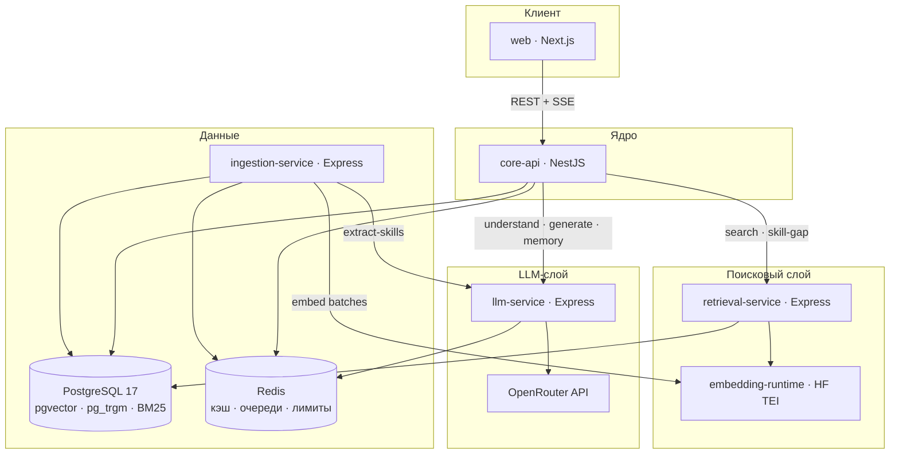
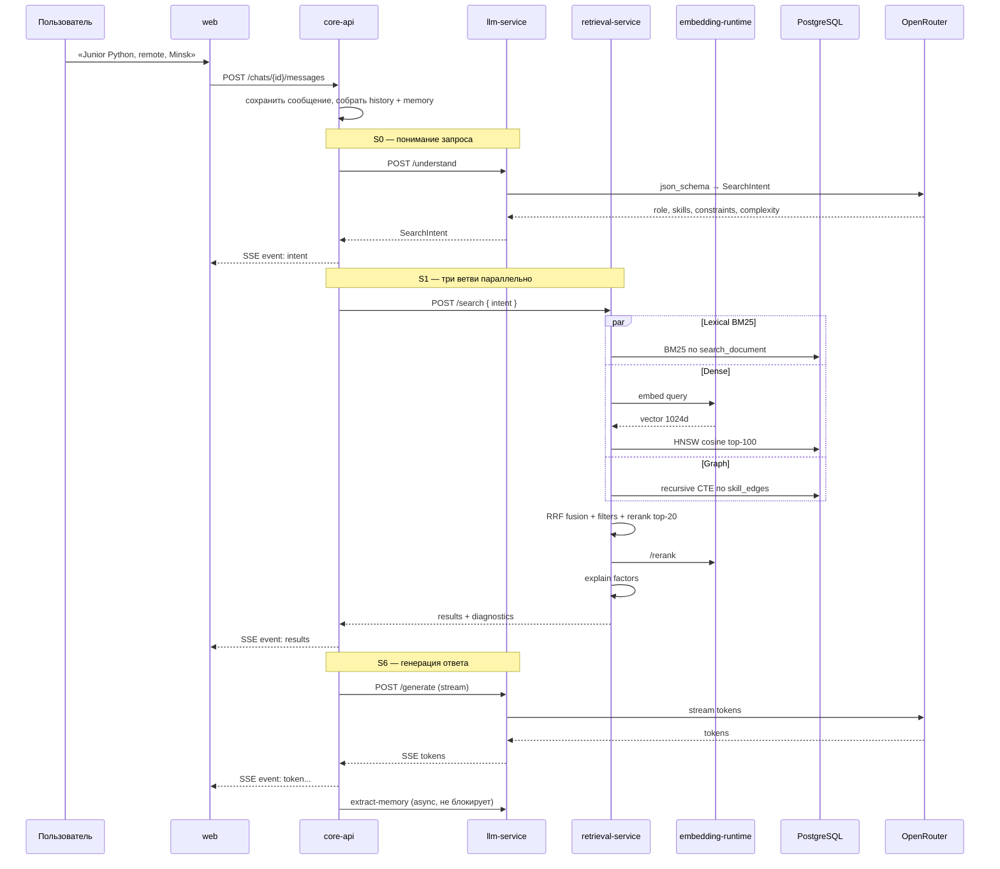
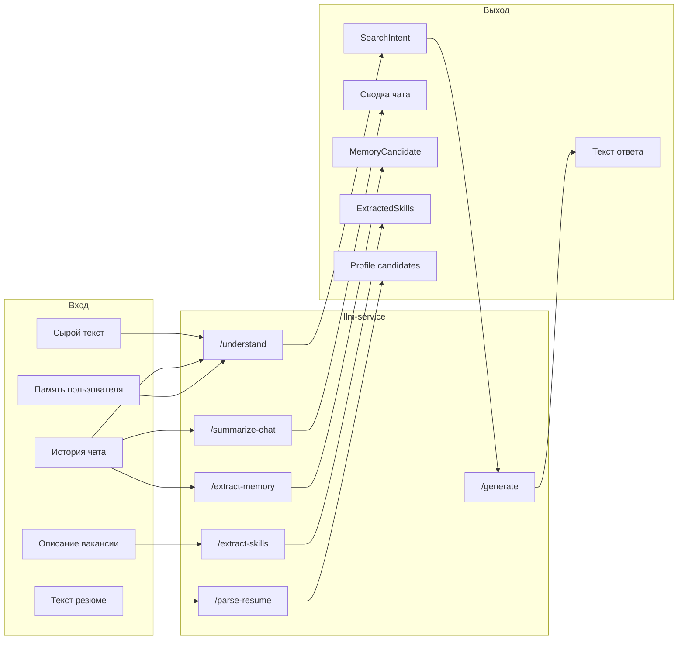
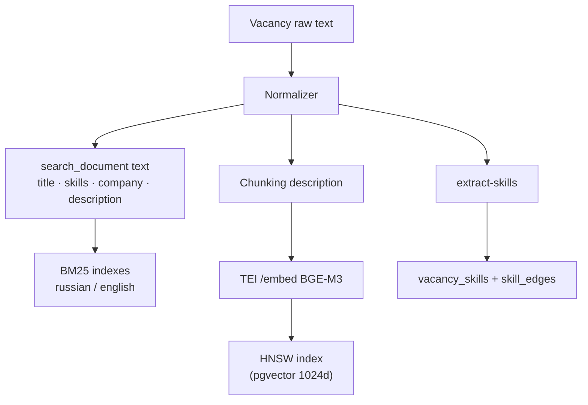
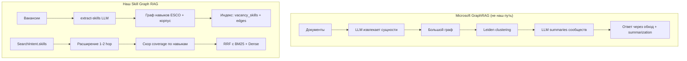
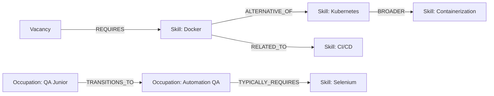
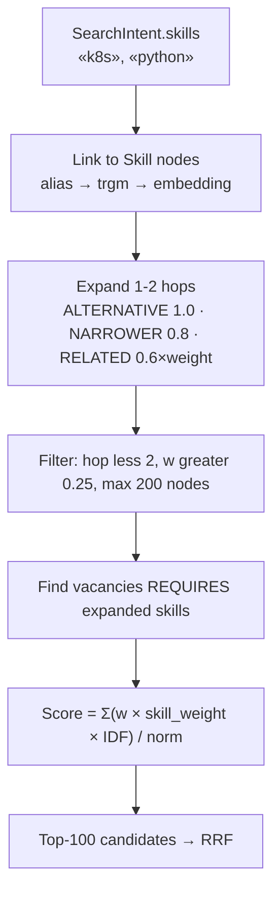
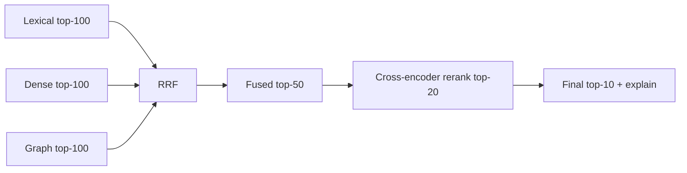

# LLM, Lexical Search & Graph RAG — Summary

> **Краткая выжимка, чтобы понять суть.**  
> Не заменяет [02-retrieval-layer.md](02-retrieval-layer.md) и [01-architecture.md](01-architecture.md), а объясняет «как это живёт» простым языком: сервисы, модули, технологии, зачем они нужны и чем отличаются от курсовой 2026.  
> **Политика (ADR-022):** качество и новизна **важнее скорости**; мощные модели; индексация overnight; latency на локальном CPU — не блокер (обоснование для комиссии).

---

## 1. Одной фразой

**2026:** один bi-encoder (Sentence-BERT) + LLM только для фильтров.  
**2027:** **три ветви поиска** (лексика BM25 + плотные векторы + граф навыков) → слияние RRF → реранк cross-encoder → объяснение «белым ящиком» → ответ LLM.  
**Graph RAG будет**, но **не вместо** векторного поиска — как **третья ветвь** в гибриде, плюс граф строится **офлайн** при ingestion, а не «Microsoft GraphRAG с community summaries».

---

## 2. Карта микросервисов (кто за что отвечает)



| Сервис | Стек | Роль в LLM / lexical / graph |
|---|---|---|
| **`core-api`** | NestJS, TypeORM | **Дирижёр.** Собирает историю чата + память, вызывает `understand` → `search` → `generate`, стримит SSE клиенту. Сам модели не гоняет. |
| **`llm-service`** | Express | **Единственная точка доступа к LLM.** Structured output, стриминг, кэш, ретраи. |
| **`retrieval-service`** | Express | **Весь поиск:** BM25, pgvector, обход графа, RRF, реранк, explain. Принимает `SearchIntent`, не сырой текст. |
| **`ingestion-service`** | Express, BullMQ | **Офлайн:** вакансии → навыки (LLM) → граф → эмбеддинги → индексы. |
| **`embedding-runtime`** | HF TEI (Docker) | **Локальные нейросети:** BGE-M3 encoder + **`bge-reranker-v2-m3`** (568M, prod). Лёгкий reranker — абляции/деградация. |
| **PostgreSQL** | pgvector, pg_textsearch, pg_trgm | **Хранилище всего:** вакансии, векторы, BM25-индекс, **граф навыков** (таблицы + recursive CTE). |
| **Redis** | ioredis, BullMQ | Кэш ответов LLM, очереди ingestion, rate limit (demo 3 / user 20/day). |

**Почему так разделено:** LLM — медленный и платный; поиск — детерминированный и должен быть быстрым; ingestion — фоновый. На защите можно показать: «заменили monolith FastAPI на orchestrator + специализированные сервисы».

---

## 3. Полный путь одного сообщения пользователя



---

## 4. Слой LLM — подробно

### 4.1 Зачем LLM вообще, если есть поиск?

LLM **не заменяет** поиск. Она решает то, что поиск плохо умеет:

| Задача | Без LLM | С LLM |
|---|---|---|
| «А можно удалёнку?» (уточнение) | Непонятно, к чему относится | Переписывает в полный запрос с учётом истории |
| «Хочу что-то с данными и медициной» | Нет явных ключевых слов | Извлекает role/skills/constraints → `SearchIntent` |
| Объяснить пользователю результат | Сухой список карточек | Связный текст **на основе** уже посчитанных факторов |
| Запомнить предпочтения | — | `extract-memory` → долговременная память |
| Разобрать резюме PDF | — | `parse-resume` → навыки в профиль |

**Новизна относительно 2026:** LLM там только вытаскивала JSON-фильтры. Теперь — **диалог**, **память**, **переписывание запроса**, **классификация сложности** (управляет весами ветвей поиска).

### 4.2 Микросервис `llm-service` — модули

```
llm-service/src/features/
├── provider/          # OpenRouter client, конфиг моделей, X-LLM-Provider header
├── understand/        # query + history + memory → SearchIntent (json_schema)
├── generate/          # intent + results + explanations → SSE stream
├── summarize-chat/    # mid-term память чата
├── extract-memory/    # long-term факты о пользователе
├── extract-skills/    # описание вакансии → навыки + evidence_span
├── parse-resume/      # текст резюме → навыки/опыт
└── title-chat/        # заголовок чата по первому сообщению
```

### 4.3 Библиотеки и технологии (LLM)

| Компонент | Технология | Зачем |
|---|---|---|
| HTTP-клиент | **Axios** | Вызовы OpenRouter, таймауты |
| Structured output | **JSON Schema** (`response_format: json_schema`, `strict: true`) | `SearchIntent`, навыки, память — без «угадывания» JSON regex'ом |
| Провайдер | **OpenRouter** | Один API, много моделей; платные модели с json_schema |
| Кэш | **Redis** + hash промпта | Повторные `extract-skills` / `understand` почти бесплатны |
| Очереди (косвенно) | **BullMQ** в ingestion | Массовый `extract-skills` не блокирует API |
| Валидация ответа | **Zod** / **class-validator** | После LLM — проверка схемы; до 2 ретраев с ошибкой в промпте |
| Стриминг | **ReadableStream** / SSE | `generate` отдаёт токены по мере генерации |

### 4.4 Что делает каждый эндпоинт



**Важно для защиты:** объяснение *почему* вакансия релевантна считается **в коде** (`retrieval-service/explain`), LLM только **пересказывает** готовые факторы — не придумывает причины.

---

## 5. Лексическая обработка — подробно

### 5.1 Зачем отдельная лексическая ветвь?

**Плотный (vector) поиск** хорош для смысла: «backend на Python» ≈ «разработчик серверной части».  
**Плох** для точных строк: `1С:Предприятие 8.3`, `ГОСТ 34`, `k8s`, редкие аббревиатуры — embedding может «размазать» термин.

**BM25** — классическая формула ранжирования из Information Retrieval (Robertson–Walker). Считает, насколько редкие слова запроса встречаются в документе, с насыщением (много повторов — не бесконечный буст). Это **стандарт 2026** для hybrid RAG (JobMatchAI и обзоры hybrid retrieval).

**Почему не встроенный `ts_rank_cd` PostgreSQL?**  
`ts_rank_cd` — другая эвристика, не BM25. Для научной работы и сравнения с литературой нужна **именно BM25** → расширение **`pg_textsearch`**.

### 5.2 Где живёт лексика — не отдельный сервис

Лексика — **модуль внутри `retrieval-service`**, не отдельный микросервис:

```
retrieval-service/src/features/
├── lexical/
│   ├── bm25-search.service.ts      # pg_textsearch, top-100
│   └── sparse-bge-search.service.ts # только для абляций (Q12)
├── dense/
│   └── hnsw-search.service.ts      # pgvector + TEI embed
├── graph/
│   └── skill-graph-search.service.ts
├── fusion/
│   └── rrf-fusion.service.ts
├── rerank/
│   └── cross-encoder.service.ts    # TEI /rerank
└── explain/
    └── match-explanation.service.ts
```

### 5.3 Как индексируется текст (офлайн, `ingestion-service`)



В документ входят `title`, извлечённые навыки (`skills_text`), `company_name` и `description`. Отдельных весов полей нет: BM25 оценивает текст целиком (ADR-030).

**Язык:** у каждой вакансии `language` = `ru` | `en` → свой частичный индекс (`russian` / `english`). Двуязычный корпус без перевода всего текста.

### 5.4 BM25 vs sparse BGE-M3 (Q12)

| | BM25 (`pg_textsearch`) | Sparse BGE-M3 |
|---|---|---|
| **Где** | Prod, основная лексическая ветвь | Абляции в главе 4 |
| **Как** | Классический inverted index + IDF | Lexical weights той же модели, что и dense |
| **Зачем обе** | Показать экспериментом, что лучше на *вашем* корпусе |

В **продакшн-fusion** участвует **BM25**; sparse BGE-M3 — строки 1a/1b/1c в таблице абляций.

### 5.5 Преимущества лексической ветви (для ответа комиссии)

1. **Точные термины** — то, что vector search пропускает.  
2. **Интерпретируемость** — видно, какие токены совпали.  
3. **Дешёвый inference** — чистый SQL, без GPU, миллисекунды.  
4. **Robustness** — если dense «промахнулся», RRF всё равно подтянет документ из lexical top.

---

## 6. Graph RAG — будет ли и как именно

### 6.1 Короткий ответ на вопрос с прошлой защиты

| Вопрос | Ответ |
|---|---|
| **Graph RAG будет?** | **Да**, но не Microsoft GraphRAG «вместо всего». |
| **Что это у нас?** | **Граф навыков** + **графовая ветвь retrieval** (S1c) в гибридном пайплайне. |
| **Neo4j?** | **Нет.** Граф в **PostgreSQL** (таблицы `skills`, `skill_edges`, `vacancy_skills` + recursive CTE). |
| **Community summaries?** | **Нет.** Не строим LLM-сводки по кластерам графа — для поиска вакансий это overkill. |

### 6.2 Чем наш подход отличается от «классического GraphRAG»



**Microsoft GraphRAG** заточен под *глобальные вопросы к корпусу* («о чём все документы?»).  
**Наша задача** — *найти конкретные вакансии* по навыкам, синонимам и карьерным связям. Поэтому граф **предметный** (skills / occupations), а не «любые сущности из текста».

### 6.3 Из чего состоит граф



| Тип узла | Пример | Откуда |
|---|---|---|
| `Skill` | Python, Kubernetes, 1C | LLM extract + ESCO + алиасы |
| `Occupation` | «Junior Backend Developer» | ESCO + агрегация корпуса |
| `Vacancy` | конкретная вакансия | ingestion |
| `Company`, `Location` | EPAM, Minsk | нормализация |

| Тип ребра | Смысл | Источник |
|---|---|---|
| `REQUIRES` | вакансия требует навык | extract-skills |
| `ALTERNATIVE_OF` | k8s ↔ Kubernetes | алиасы / ESCO |
| `BROADER/NARROWER` | React ⊂ JS frameworks | ESCO иерархия |
| `RELATED_TO` | Docker ~ CI/CD | **PMI по корпусу** (ночной пересчёт) |
| `TRANSITIONS_TO` | QA → Automation QA | ESCO + статистика |

**Новизна vs 2026:** графа **не было вообще**. Доменный буст — три зашитых словаря; теперь — **статистика корпуса** (IDF навыков, PMI для `RELATED_TO`).

### 6.4 Как работает графовая ветвь при поиске (S1c)



**Пример для защиты:**  
Запрос: «нужен опыт с k8s».  
Граф: `k8s` → `ALTERNATIVE_OF` → `Kubernetes` → `RELATED_TO` → `Docker`, `Helm`.  
Vector search мог не связать аббревиатуру; граф **явно** расширяет множество навыков.

**Adaptive routing:** для `complexity = SIMPLE` вес графа **0.1**; для `EXPLORATORY` / карьерных запросов — **до 0.4**. Не платим за граф на «Junior Python Minsk».

### 6.5 Как граф строится (офлайн)

Это **не realtime GraphRAG**, а **batch pipeline** в `ingestion-service`:

1. **Fetch** вакансий (6 источников).  
2. **Normalize** → единая схема, `content_hash`.  
3. **extract-skills** (LLM, BullMQ, кэш Redis) → навыки + `evidence_span`.  
4. **Normalize skills** → канон ESCO: exact → alias → pg_trgm → vector match.  
5. **Write** `vacancy_skills`, обновить `skill_edges` (`REQUIRES`).  
6. **Nightly job:** пересчёт `RELATED_TO` (PMI), IDF навыков.  
7. **Embed** (TEI) → pgvector HNSW.  
8. **BM25 index** → pg_textsearch.

Граф **живёт вместе с вакансиями** в одной PostgreSQL — нет рассинхрона «графовая БД vs relational».

---

## 7. Слияние трёх ветвей — почему RRF

Три ветви выдают **несопоставимые скоры**:

| Ветвь | Скор | Диапазон |
|---|---|---|
| BM25 | term frequency × IDF | 0 … ∞ |
| Dense | cosine distance | 0 … 2 |
| Graph | weighted coverage | 0 … 1 |

**RRF (Reciprocal Rank Fusion):**  
`score(doc) = Σ w_branch / (60 + rank_branch(doc))`  

Используются **ранги**, не сырые числа → не нужно нормализовать BM25 к cosine.



После RRF — **cross-encoder prod:** **`BAAI/bge-reranker-v2-m3`** (568M, top-20, TEI CPU/ONNX). Лёгкие reranker'ы (~278M) — абляции и режим без rerank.

---

## 8. Сколько времени занимает каждый слой (i9-9880H, CPU)

Замеры: [`cpu-tei-benchmark/`](../cpu-tei-benchmark/) (FP32 PyTorch, 2026-09-20). Prod TEI INT8 — ориентир **~1.5–2× быстрее**.

### 8.1 Один запрос пользователя — retrieval (без LLM)

| Слой / модуль | Время | Примечание |
|---|---|---|
| **BM25** (`pg_textsearch`) | **~0.05–0.15 s** | SQL, параллельно |
| **Graph** (recursive CTE) | **~0.03–0.12 s** | параллельно |
| **BGE-M3** encode query | **~0.12 s** | 117 ms, замер |
| **pgvector HNSW** (dense) | **~0.08–0.25 s** | параллельно |
| **RRF + filters + explain** | **~0.05 s** | код |
| **Rerank v2-m3** top-20 | **~6.5 s** | главный bottleneck |
| **Поиск целиком** | **~7–8 s** | с мощным reranker |
| **Без rerank** (деградация) | **~0.5 s** | toggle |

### 8.2 LLM-слой (OpenRouter, оценка)

| Модуль | Время | Пользователь ждёт? |
|---|---|---|
| `/understand` | **~1–2.5 s** | да → event `intent` |
| `/generate` | **+2–6 s** | да, стриминг; карточки **раньше** текста |
| `/extract-memory`, `/summarize-chat` | **~1–4 s** | нет, async |

**Полный чат (typical):** **~10–20 s**; допустимо до **~1–2 min** (ADR-022). UX: spinner «Searching…», SSE.

### 8.3 Offline (на ночь)

| Job | Время |
|---|---|
| Индексация 60k embeddings (BGE-M3) | **~11 h** FP32 / **~6 h** INT8 |
| Dev-снимок 2k вакансий | **~20 min** |
| extract-skills 15k вакансий | **~4–12 h** |

---

## 9. Сводная таблица: технологии → зачем → новизна

| Технология | Где | Зачем | Новизна vs 2026 |
|---|---|---|---|
| **OpenRouter + json_schema** | llm-service | Понимание запроса, навыки, память, резюме | LLM только для фильтров → полный диалоговый слой |
| **BM25 (pg_textsearch)** | retrieval-service → PG | Точные термины, hybrid IR | Не было лексической ветви |
| **BGE-M3 + pgvector HNSW** | TEI + PG | Смысл, кросс-язык RU↔EN | MiniLM-384 без индекса → BGE-M3-1024 + HNSW |
| **Skill graph + CTE** | PG + retrieval-service | Синонимы, смежные навыки, career hops | Графа не было |
| **RRF fusion** | retrieval-service | Объединение несопоставимых скоров | Одна ветвь → три + fusion |
| **Cross-encoder rerank (v2-m3, 568M)** | TEI | Точность top-10; качество > скорость (ADR-022) | Не было реранка |
| **Deterministic explain** | retrieval-service | skill fit, lexical, graph path… | Один cosine → 6 факторов |
| **Redis** | core-api, llm, ingestion | Кэш LLM, BullMQ, rate limits | Не было |
| **BullMQ** | ingestion-service | Фоновый extract-skills/embed | Синхронный пайплайн → очереди |

---

## 10. Что говорить на защите (шпаргалка)

**Про LLM:**  
«LLM — слой понимания и генерации. Поиск детерминированный, воспроизводимый, измеряемый в абляциях. LLM не ранжирует вакансии — она структурирует запрос и формулирует ответ по уже посчитанным факторам.»

**Про лексику:**  
«Добавлена BM25-ветвь — industry standard для hybrid retrieval. Ловит точные термины и редкие технологии, которые semantic search размывает. Реализовано через pg_textsearch в PostgreSQL, без отдельного Elasticsearch.»

**Про Graph RAG:**  
«Graph RAG реализован как **графовая ветвь гибридного retrieval**, а не замена vector search. Граф навыков строится при ingestion из LLM-extraction + таксономии ESCO + статистики корпуса. Обход — recursive CTE в PostgreSQL, до 2 hops. На простых запросах вес графа минимален; на карьерных и мультихоп — основной вклад. Это соответствует JobMatchAI (ACL 2026) и консенсусу hybrid RAG 2026.»

**Про отличие от Microsoft GraphRAG:**  
«Мы не строим community summaries и не используем граф для глобальной суммаризации корпуса. Наш граф — **domain-specific knowledge graph навыков**, интегрированный в RRF вместе с BM25 и dense search.»

**Про latency (ADR-022):**  
«На локальном CPU без GPU полный цикл занимает порядка **7–8 s** на retrieval и **10–20 s** на ответ в чате — это зафиксировано бенчмарком. Мы сознательно выбрали **мощные модели** (BGE-M3 + bge-reranker-v2-m3) ради качества и новизны; на GPU/сервере latency была бы sub-second. Индексация корпуса — **overnight job**.»

---

## 11. Связанные документы

| Документ | Содержание |
|---|---|
| [02-retrieval-layer.md](02-retrieval-layer.md) | Полное научное обоснование, формулы, абляции |
| [01-architecture.md](01-architecture.md) | Микросервисы, docker-compose, сквозной сценарий |
| [04-data-model.md](04-data-model.md) | Схема графа, SQL пример CTE |
| [07-auth-and-memory.md](07-auth-and-memory.md) | Память LLM, профиль, resume |
| [10-decision-log.md](10-decision-log.md) | ADR: BM25, OpenRouter, Redis, graph in PG, **ADR-022** (quality > speed) |
| [../cpu-tei-benchmark/report.md](../cpu-tei-benchmark/report.md) | Бенчмарк CPU, estimated time по слоям |
| [progress-log.md](progress-log.md) | Этапы разработки и % |
| [diagrams/architecture.png](diagrams/architecture.png) | Общая схема системы |
